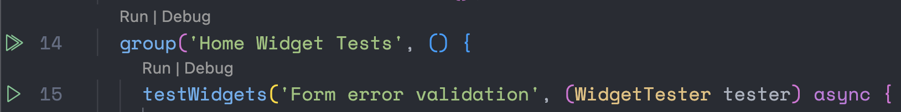
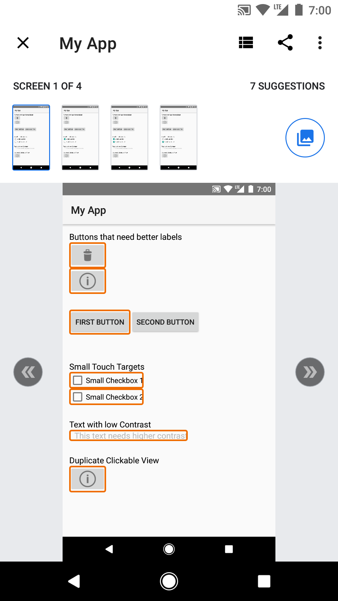

# Flap App Flutter Sandbox

## Philosophy
This repository is meant as a learning tool to get familiar with Flutter, and the tools we have found useful in development. The app may not do much, but it aims at giving a foundation of how the architecture works, and how useful libraries work with each other. This repository is not perfect, there will always be ways to improve. Once you feel comfortable, think about contributing to make it better. All help is welcome!

## Table of Contents
1. [Getting Started with Flutter](#getting-started-with-flutter)
2. [Running and Building the App](#running-and-building-the-app)
3. [Libraries Used](#libraries-used)
4. [Architecture](#architecture)
5. [Folder Structure](#folder-structure)
6. [Dependency Injection](#dependency-injection)
7. [Navigation](#navigation)
8. [Environment Variables](#environment-variables)
9. [Testing](#how-and-what-is-tested)
10. [Mocking API Calls](#mocking-api-calls)
11. [Analytics Implementation](#analytics-implementation)


## Getting Started With Flutter

If this is your first flutter project, don't worry, we will help you through it! Below are some great resources to get caught up to speed

- [Lab: Write your first Flutter app](https://docs.flutter.dev/get-started/codelab)
- [Cookbook: Useful Flutter samples](https://docs.flutter.dev/cookbook)

For help getting started with Flutter development, view the[online documentation](https://docs.flutter.dev/), which offers tutorials,
samples, guidance on mobile development, and a full API reference.


## Running and Building the App

- First, create a .env file at the root of the project. This file will include the api key for Spoonacular (reach out to a code-owner for the Spoonacular password. You also can create your own account, this is a free API! ):
`SPOONACULAR_API_KEY=<insert api key here from 1password>`
- We rely on generated code files in this project, so after .env is created - run the below command:
`flutter pub run build_runner clean && flutter pub run build_runner build --delete-conflicting-outputs`

You can launch the app two ways:

- **Terminal**: Use the below command (substitute 'dev' with the flavor you need)
`flutter run --flavor dev --dart-define="FLAVOR=dev" `
- **Launch from VS Code**: In the Run and Debug menu, there will be a drop-down menu with flavors specified - as well as unit tests / integration test build configurations.

  
## Libraries Used

- Navigation: [go_router] (https://pub.dev/packages/go_router)
- Fonts: [Google Fonts](https://pub.dev/packages/google_fonts)
- Change App Package Name: [Name Change](https://pub.dev/packages/change_app_package_name) Allows you to change the project name through terminal instead of doing it manually. Feel free to remove it after forking!
- Secret Management: [Envied](https://pub.dev/packages/envied)
- Secure Storage: [Flutter Secure Storage](https://pub.dev/packages/flutter_secure_storage)
- Object Equitability: [Equatable](https://pub.dev/packages/equatable)
- Localization: [Localization](https://pub.dev/packages/localization) Allows you to provide translation for different locales. To provide a new locale, simply add an app_[locale].arb file to the /lib/I10n folder and add string translations.


## Architecture

The architecture used stems from [Flutter - Clean Architecture](https://github.com/guilherme-v/flutter-clean-architecture-example). We found this architecture allowed for ease of use and flexibility. You should be in good hands with it's documentation. Any changes we make that diverge from the proposed architecture should be noted here.

### Folder Structure

This project uses a slightly different folder structure for tests than the official flutter docs. We have opted to mirror the folder structure of the greater application, to make it easier for both developers and test engineers to contribute, and find what they are looking for.

The test folder structure suggested by the flutter documentation can be found [here]([https://docs.flutter.dev/testing/integration-tests](https://docs.flutter.dev/testing/integration-tests))


## Dependency Injection

Dependency injection (DI) is a fundamental concept in software development that promotes loose coupling and enhances the maintainability, scalability, and testability of code. By allowing the injection of dependencies from external sources rather than hard-coding them within a class or module, DI facilitates modular and reusable code. This decoupling of components makes it easier to replace or upgrade individual modules without affecting the entire system, fostering a more flexible and agile development process. Moreover, DI simplifies unit testing, as dependencies can be easily substituted with mock objects or test doubles, enabling more robust and efficient testing of isolated components. Overall, dependency injection promotes the principles of separation of concerns and inversion of control, leading to cleaner, more modular, and maintainable code in software applications.


## Navigation

go_router is a declarative routing package helpful for advanced navigation requirements (such as a web app that uses direct links to each screen or an app with multiple "navigation graphs" or navigation widgets). This package was mentioned here in the flutter docs: https://docs.flutter.dev/ui/navigation


## Environment Variables

Secrets are managed using the [Envied](https://pub.dev/packages/envied) dart package. Developers are expected to provide a `.env` file at the root of the project to be used by Envied. Envied works by generating a class which can then be used to access the values of the keys within the env file. To generate or update the class, run the following commands:
`flutter pub run build_runner clean && flutter pub run build_runner build --delete-conflicting-outputs`

An example of how Envied is used can be found at `/lib/env/env.dart`

**Note**
1. The generated files for Envied do not get committed so that the secrets are not in source control
2. Any time you make a change you need to your env you need to rerun the build runner so its picked up ([this is an open issue](https://github.com/petercinibulk/envied/issues/6) right now for Envied)
3. The first time you run the build-runner with Envied you have to comment out the env.dart file, run the build runner, then uncomment the file and run again ([there is also an open issue](https://github.com/petercinibulk/envied/issues/59) on this)


## How and What Is Tested?

Testing is being run primarily using VSCode. Extensions that help make testing possible include:
- [Dart language extension](https://marketplace.visualstudio.com/items?itemName=Dart-Code.dart-code)
- [Flutter support extension](https://marketplace.visualstudio.com/items?itemName=Dart-Code.flutter)

The flutter support extension should allow you to run tests in VSCode.



To run a test using VSCode, navigate to your test file in the explorer tab and open it. You can run each test via the play button found in the line number column, or by clicking run above a test. All tests in this repo are part of a "group", so to run all tests in a test file, you can click the play button at the start of a group. (Please see screenshot above)

This project follows the Page Object Model structure, with each screen having a separate file that defines all screen elements for reuse in all test files. For example, in the test/screens directory, we have a file titled "home_screen.dart" that should contain all variable declarations or possible reusable functions related to just the homescreen. The hope is that by organizing the project this way, we can avoid repeated code, increase readability, and make our test code easier to maintain if an element ever changes. To build on the previous example, you can see that both the homescreen integration tests, and homescreen widget tests import and use the homescreen.dart file.

For more information on the Page Object Model, please visit this [helpful page](https://www.geeksforgeeks.org/page-object-model-pom/).

### Unit Tests:

These tests are described by the flutter documentation as verifying "the behavior of a method or class". These tests are the most lightweight of the three, and don't verify any visual elements. Instead, these tests are meant to assert on the logic of a single method or overall class, and ensure it returns the value we expect. These tests are also meant to be run as part of PR verification, as they help make sure that the app is still functioning as expected after changing a functionality.

For more information, please see the official flutter docs related to [Unit Testing](https://docs.flutter.dev/cookbook/testing/unit/introduction)

### Widget Tests:

These tests are designed to be lightweight and focus on asserting on the hierarchy of the application, and the widgets contained within it. The core difference between widget tests and integration tests, is that these tests are run without the need to build and emulate your application. This can save valuable time on a CI/CD pipeline. Due to their lightweight and quick-to-run nature, these are the ui related tests that are best suited to run as part of the PR verification process.

For more information, please see the official flutter docs related to [Widget Testing](https://docs.flutter.dev/cookbook/testing/widget/introduction).

### Integration Testing:

These tests are designed to be more exhaustive and robust, testing the logic of the application and ensuring the correct scenarios are occurring as expected. These tests are meant to assert on end2end user journeys laid out in Acceptance Criteria. Meaning, these tests will complete a certain scenario in the app from start to finish.

For example, with a login screen, an integration test might involve inputting valid credentials into the email and password fields, hitting the login button, and asserting that login was successful. Or, it may involve entering invalid credentials, and asserting the users login attempt was unsuccessful.

Flutter Integration tests build the full application on an emulated device or browser. Because of this increased overhead, these tests are suggested to be run less often than widget and unit tests, especially on a CI/CD pipeline where proper infrastructure for supporting this can be costly.

For more information, please see the official flutter docs related to [Integration Testing](https://docs.flutter.dev/testing/integration-tests).

### Mockito:

The Mockito flutter package (https://pub.dev/packages/mockito) in combination with the build-runner will create generated files with mocked class code. For example, in the home_page_state_notifier_test the repository class is annotated above the test as a class that requires a mock. The behavior needs to be defined for the mocked method (ex. getRandomRecipes is defined with a .thenAnswer). A provideDummy is also required in cases where the return type is generic and your test is expecting an explicit return type. The build runner will auto-generate the corresponding mock with a class that ends with "mocks.dart".

### Fakes versus Mocks

For this generic implementation of a Flutter App, we have shown both ways of substituting dependencies. We want to focus on how to implement either so you may make the best decision for your project. Our suggestion however is to favor Fakes instead of Mocks. Even though there will be more upfront code, you will be better equipped at using these substitutions in other test areas. For instance you can reuse the AuthRepositoryFake in the LoginWidget tests in order to remove the dependency of the network (if AuthRepositoryImple actually made a network call).

Please take a look at some of these resources for further reading:

- [Test Doubles](https://martinfowler.com/bliki/TestDouble.html)
- [Prefer Fakes Over Mocks](https://tyrrrz.me/blog/fakes-over-mocks)
- [Interchangeable Fakes and Mocks](https://medium.com/@june.pravin/mocking-is-not-practical-use-fakes-e30cc6eaaf4e)

### Accessibility Tests

Android has an app called [Android Accessibility Scanner](https://play.google.com/store/apps/details?id=com.google.android.apps.accessibility.auditor&hl=en_US&gl=US) that can be used to perform automated accessibility audits. This app is only able to be installed and used on a physical Android device, due to android emulators lack of access to the play store. This app highlights parts of the app that don't fit into standard accessibility guidelines.



iOS has access to a UI Test class called performAccessibilityAudit that can be performed with an emulator via XCTest. The console output will display any issues found while the audit was performed. The Accessibility Audit is based on [Apple's Accessibility best practices](https://developer.apple.com/documentation/xctest/xcuiapplication/4191487-performaccessibilityaudit).


## Mocking API Calls

There are times where you want to mock an API call. Maybe the API is still in development, maybe they are down all together, but most importantly you can use this for reliable integration tests! Below are a couple things to know and keep in mind while you make changes.

### How does it work?

In order to mock API calls, we added an Interceptor to our Dio object. Interceptors are essentially a middleware between the call you want to make and the response you get back. We leverage this flow by making our own Interceptor. The MockInterceptor is in charge of checking out the URI, and checking to see if it matches responses we are looking for through FileFinders. FileFinders are in charge of checking to see if the URI matches some sort of usage. If you look at SpoontacularFileFinder, it is in charge of checking if the URi matches a call to fetch recipies. If the structure of the URI matches, then the FileFinder returns the file name of the mock response we want to return. We wanted to keep this example as simple as we could, but feel free configure it as you like!


TLDR:

1. API call is started
2. MockInterceptor loops through FileFinders
3. FileFinders check to see if the URI matches something it is looking for
4. If any FileFinder returns a file name, then we return that files JSON. Otherwise, we continue with making the API call without any interference.

### How do I make my own FileFinder?

You may want to address a specific use case for mocking a response. This should be done by making your own FileFinder, which is relatively easy. Create your FileFinder class, and make sure to extend FileFinder.
```

class MyFileFinder extends FileFinder {

	@override
	String? getJsonPath(Uri uri) {
		//Logic to determine if the URI is the one you are looking for
	}

}

```
After that make sure to add it to the list of current FileFinders used. The list of current FileFinders can be found in the providers.dart file.
```

@riverpod
List<FileFinder> mockFileFinders(MockFileFindersRef ref) {

	//Add your file finders here.
	return [
		SpoonacularFileFinder(),
	];
}

```
### Testing with Mocked API Calls

Mocked API calls currently are turned on only for the Mock flavor. This makes it very intentional when you want to use it. It's just that easy!

### Analytics Implementation

This project provides an abstract class to support multiple Analytics platforms, the class can be found at `lib/domain/repository/analytics_repository.dart`. Users are expected to provide implementations for `logEvent, setUserProperties, and screenView` and instantiate the class in `lib/data/repository/analytics/analytics_repository_impl.dart`. The presentation layer can access analytics via the `analyticsProvider` defined in the providers file.